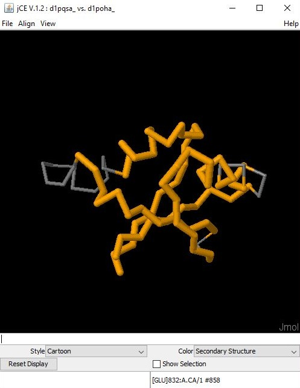
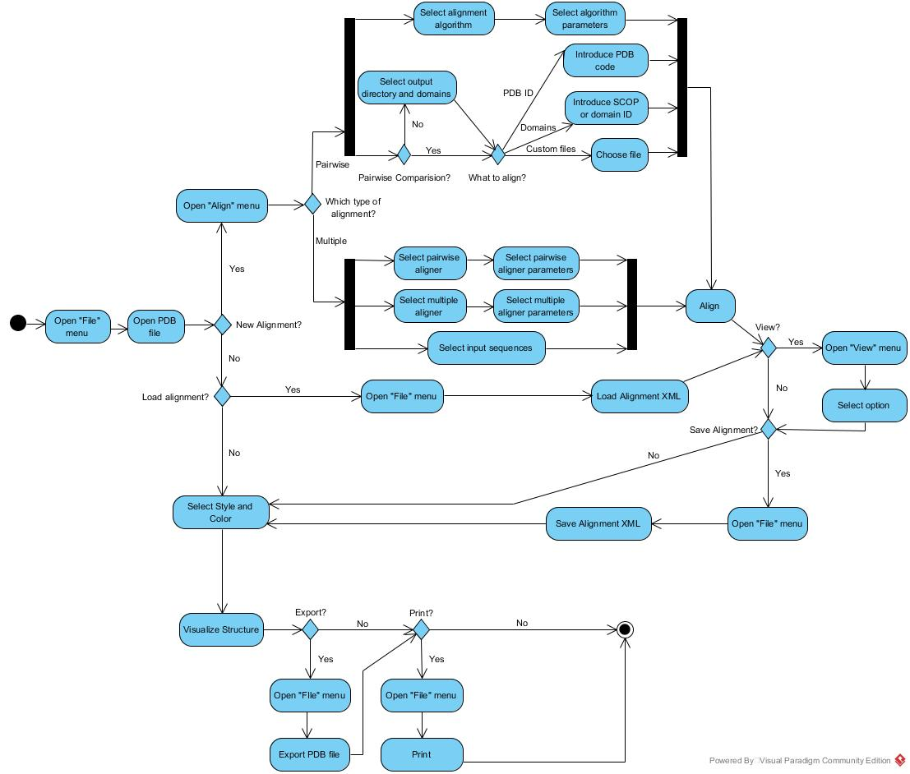

## Development View

There are three main project libraries that are used in almost all of the others components: the Core library, the Structure library and the Alignment Library.

The core library interfaces with the other components (e.g.: sequencing library, structure library, alignment library) allowing those libraries to access standard proteins and nucleotide sequences. The structure and alignment libraries allow the other components to have access to structure and alignment tools, respectively.

Then there are another three external libraries - MMTF, VecMath and Forester - that are used by a significant part of the components. The MMTF is a specific format for binary encoding of biological structures, so the MMTF libraries provide tools for decoding and coding on this format. The VecMath allows the libraries that interface with it to use tools for mathematical calculations with arrays. The forester API provides tools for comparison of proteins and nucleotide sequences.

Mod Finder sequencing, Disorder predictor, Genome and AminoAcid properties libraries interface with some of the previously described components whose interfaces have also been previously described.

Then, one of the most important components to the user is the Structure GUI, which is a tool for 3D visualization of the proteins and its alignment (described in Section Process View). So, with this purpose, it interfaces the JMOL API that provides tools for representation of chemical structures in 3D, allowing the Structure GUI to show the 3D visualization of the proteins. Additionally, it interfaces with JColorBrewer that provides pallets of colour to the Structure GUI.

Finally, the project contains a web service that allows access to two different bioinformatics services in the web using the REST protocol, the NCBI Blast and the Hammer web service. So this component is dependent of these two services.

It was decided that it would be best to divide the component diagram in two parts due to the high amount of interfaces between components caused by the complexity of the project. The two parts of the diagram are the following:

##Process View

Since BioJava is a framework, there are some demos available to illustrate the usage of the tools it provides. Among all the modules of Biojava, the structure module is the only one with a graphical user interface. Thus, by running the demos for that module it was possible to understand how the interface works. The GUI has 3 menus - "File", "Align" and "View" -, a 3D visualization of the structure and some options:

The "File" menu allows to open or export a PDB file, load or save an Alignment XML and Print. So first, it is necessary to open a protein structure through a PDB file. Then, the user can simply visualize the structure and select a color and style for the representation or perform a new alignment. As the "View" menu allows to check some results of the alignment, it is expected that an alignment will be performed (or loaded) first. An alignment (multiple or pairwise) can be performed through the "Align" menu. The flow of operations is described on the following activity diagram:

