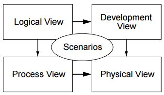
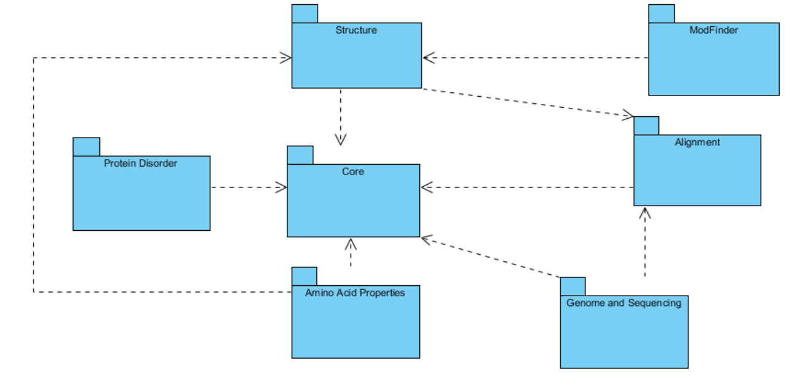
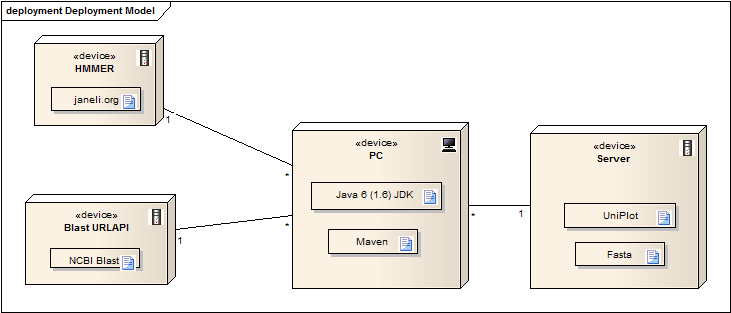

#Software Architecture and the 4+1 Architectural View Model

##Introduction

Software architecture can be described by multiple views, dealing with design and implementation of high-level structures of the software. With software architecture, it is possible to combine architectural elements in specific forms in order to organize and handle with functional and non-functional requirements of the system. The five perspectives are the following [[1]](https://www.cs.ubc.ca/~gregor/teaching/papers/4+1view-architecture.pdf):

* _Logical View_: supports the functional requirements and shows a set of key abstractions, in this case in form of packages;
* _Development View_: describes the static organization and composition of the software in its development environment;
* _Process View_: takes into account non-functional requirements and shows how several aspects of the design can interact with each other (concurrency and synchronization properties);
* _Deployment View_ (Physical View): describes the relations between software and hardware (how software components are distributed across the hardware nodes);
* _Use Case View_ (Scenarios): the description of the architecture can be organized around the previous four views and then be illustrated by a few selected use cases which become a fifth view (+1) that relates the other four.

Regarding architectural patterns, BioJava follows the Pipe-And-Filter architecture, since the data can arrive in multiple formats. There are several converters (RecordConverters) that do the conversion between different formats (such as Genbank Record) into FASTA format (the standard format used to represent a sequence of nucleotides) [[2]](http://biojava.org/wikis/BioJava3_Proposal/). Additionally, there is a set of tools to convert sequence strings and taxonomy strings into BioJava like-objects [[2]](http://biojava.org/wikis/BioJava3_Proposal/). That way, as one of the creators of BioJava, Spencer Bliver, says, some of the practices they have been performed is based on semantic versioning/analysis.

## Logical View

Biojava Project has several modules that allow the processing of biological data [[3]](https://www.ncbi.nlm.nih.gov/pmc/articles/PMC3467744/):
* Core: models both nucleotide and amino acid sequences and their inherent relationships;
* Protein structure: compares proteins and its structure and also provides tools for protein manipulation (3D);
* Genome and sequencing: with this model, it is possible to create sequences of genes;
* Alignment: provides tools to align sequences;
* ModFinder: provides the classes to find and classify protein modifications in protein 3D structures;
* Amino acid properties: several properties of proteins can be calculated, such as molecular weight, instability index, etc;
* Protein disorder: provides tools to predict disorder in multiple proteins;

Regarding the dependencies, the classes are dependent of core, structures and alignment modules due the fact that all the features that are implemented are related to the protein itself and to operate with the protein its structure, composition and alignment has to be well defined. That way, the package diagram is the following:

## Development View

There are three main project libraries that are used in almost all of the others components: the Core library, the Structure library and the Alignment Library.

The core library interfaces with the other components (e.g.: sequencing library, structure library, alignment library) allowing those libraries to access standard proteins and nucleotide sequences. The structure and alignment libraries allow the other components to have access to structure and alignment tools, respectively.

Then there are another three external libraries - MMTF, VecMath and Forester - that are used by a significant part of the components. The MMTF is a specific format for binary encoding of biological structures, so the MMTF libraries provide tools for decoding and coding on this format. The VecMath allows the libraries that interface with it to use tools for mathematical calculations with arrays. The forester API provides tools for comparison of proteins and nucleotide sequences.

Mod Finder sequencing, Disorder predictor, Genome and AminoAcid properties libraries interface with some of the previously described components whose interfaces have also been previously described.

Then, one of the most important components to the user is the Structure GUI, which is a tool for 3D visualization of the proteins and its alignment (described in Section Process View). So, with this purpose, it interfaces the JMOL API that provides tools for representation of chemical structures in 3D, allowing the Structure GUI to show the 3D visualization of the proteins. Additionally, it interfaces with JColorBrewer that provides pallets of colour to the Structure GUI.

Finally, the project contains a web service that allows access to two different bioinformatics services in the web using the REST protocol, the NCBI Blast and the Hammer web service. So this component is dependent of these two services.

It was decided that it would be best to divide the component diagram in two parts due to the high amount of interfaces between components caused by the complexity of the project. The two parts of the diagram are the following:

##Process View

Since BioJava is a framework, there are some demos available to illustrate the usage of the tools it provides. Among all the modules of Biojava, the structure module is the only one with a graphical user interface. Thus, by running the demos for that module it was possible to understand how the interface works. The GUI has 3 menus - "File", "Align" and "View" -, a 3D visualization of the structure and some options:

The "File" menu allows to open or export a PDB file, load or save an Alignment XML and Print. So first, it is necessary to open a protein structure through a PDB file. Then, the user can simply visualize the structure and select a color and style for the representation or perform a new alignment. As the "View" menu allows to check some results of the alignment, it is expected that an alignment will be performed (or loaded) first. An alignment (multiple or pairwise) can be performed through the "Align" menu. The flow of operations is described on the following activity diagram:

##Deployment View

BioJava is an established open-source project driven by an active developer community. This means that BioJava is a volunteer project currently supported by donated time. The hardware, bandwidth and server support is all provided through volunteers and donations. The project is hosted by the (Open Bioinformatics Foundation)[http://www.open-bio.org], which provides the source code repository, bug tracking database and email mailing lists.

The supported data range in scope from DNA and protein sequence information up to the level of 3D protein structures. BioJava provides various file parsers, data models and algorithms to facilitate working with the standard data formats and enables rapid application development and analysis.

The storage of data is designed to minimize memory usage for large collections using a ‘proxy’ storage concept. Various proxy implementations are provided which can store sequences in memory, fetch sequences on demand from a web service such as UniProt or read sequences from a FASTA file as needed. The latter two approaches save memory by not loading sequence data until it is referenced in the application. This concept can be extended to handle very large genomic datasets, such as NCBI GenBank or a proprietary database.

BioJava also contains a web services module that allows bioinformatics services to be accessed using REST protocols. Currently, two services are implemented: NCBI Blast through the Blast URLAPI (previously known as QBlast) and the HMMER web service at hmmer- janelia.org.

We can see the basis of all this in the following diagram:

The basic principles of operation can be seen (here)[[4]]http://biojava.org/wikis/BioJava3_Design/]. The most relevant ones are stated bellow:

* BioJava will freely incorporate features from Java 6.
* Maven will be used to build the project.
* Full unit testing for every aspect from the ground up using JUnit.
* Modular design without any cyclic dependencies, with separate JARs for key components (IO, databases, genetic algorithms, sequence manipulation, etc.)
* Separation of APIs from implementation code by means of packages.
* Use of JavaBeans concepts wherever possible, e.g. getters/setters. 
* Separation of functionality - this saves memory and allows work to be done independently on the specific parts of interest.
* Any general-use methods to be exposed via SPI (e.g. getTopBlastHit()).
* The source code license will be the GNU Lesser General Public License (LGPL) “version 2.1 or any later version”.
* The default Java logging API should be used extensively. This will allow a developer the ability to fine tune debugging. The core module should have a logging helper with static convenience methods to make it very easy to liberally use logging calls via static imports.

