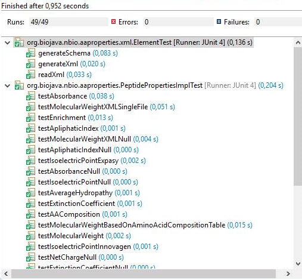
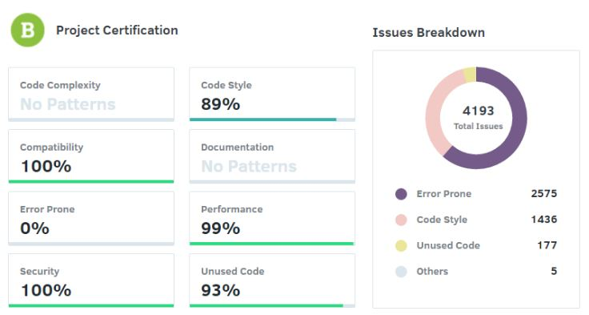
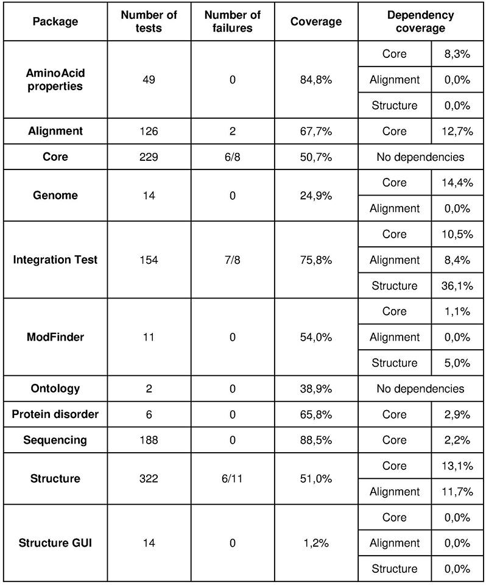
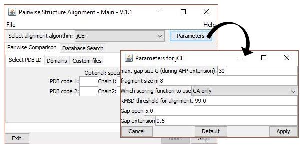
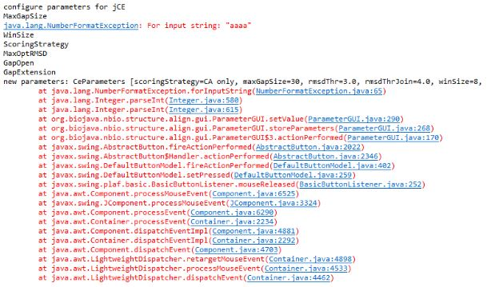
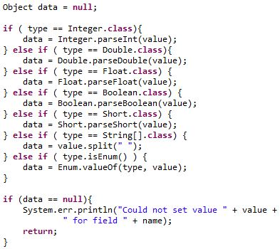
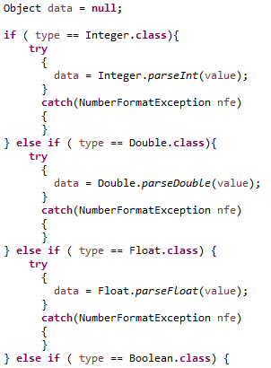
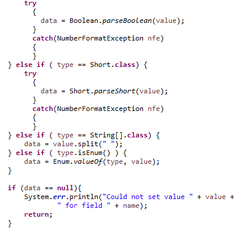
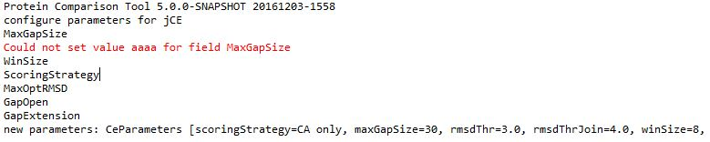

#Software Verification and Validation

##Software Testability

Since BioJava is a project that provides a Java framework for processing biological data, it is not as testable as other programs that can be runned immediately. This means that a developer is supposed to use the code of the project and apply it into his/her own project. For the same reason, it is logical that several components of the project can be tested individually and there are also some available demonstrations that can be tested (for example, the Structure package has a graphical interface demonstration).
BioJava uses Travis CI for continuous integration, building, checking and analyzing the code constantly. When a developer does a pull request on GitHub, the Travis CI tool allows to test if it can be integrated with the rest of the project and if it will not create any conflicts in the project. If a pull request fails the test, it will not integrate the project. BioJava also uses JUnit tests. JUnit tests are made automatically in a fast and more reliable way and with less investment in human resources. JUnit promotes the idea of "first testing then coding", so the goal is making a test data for a piece of code (in this case, for packages and also for each class) that can be tested first and then implemented, and obtain immediate feedback [[1]](https://www.tutorialspoint.com/junit/junit_overview.htm). Additionally, this project has also some integration tests to test the integration between packages.
Developers also rely on the community�s feedback in order to find bugs and in some of the cases correct them.
The testability of software components is determined by factors such as controllability, observability, isolateability, separation of concerns, understandability and heterogeneity.

### Controllability
Controllability determines the degree to which it is possible to control the state of the component under test as required for testing. BioJava is a complex project that has packages that depend a lot on each other, depending on the functionality that is implemented. Initial states (such as opening a file) do not require many tests and they can be easy to make. On the other hand, performing protein alignments is a quite complex task. Taking into account the growing complexity of the tests, the use of mock objects is a really good solution implemented by BioJava developers. Mocking objects are manually coded representing specific states of the program. This is really helpful since these states of the program are difficult to set up (for example, if it is required to run more classes) or time consuming to set up for a test [[2]](http://www.simpletest.org/en/mock_objects_documentation.html). For these reasons, although there are a high number of modules interacting with each other, the controllability can be high for some cases.

### Observability
Observability determines the degree to which it is possible to observe test results on an intermediate and/or final phase. As already said, on a first phase Travis CI software will build the project checking if there is possible to build it and errors can be indicated. Additionally, BioJava uses JUnit tests to check packages and also classes individually (inside a class there are several tests). The following image is an example of the AminoAcid Properties module. It is possible to see how many tests were performed and its execution time, how many errors and failures were found and also which tests failed.

For these reasons, the project has good observability providing valuable information about the location of errors.

### Isolateability
Isolateability determines the degree to which the component under test can be tested in isolation. Isolateability and controllability are related to each other. Since this project is quite complex, several modules are interdependent. That means that testing one module requires the test of other modules, leading to a low isolateability. Additionally, a test in one module can fail because the code of another module, if the first one is dependent of the second module. Meanwhile some of the packages (core, ontology) are independent libraries so they can be tested in isolation.
On the other hand, isolateability can increase due to the use of mock objects already mentioned above, allowing a more isolated test in some cases.

### Separation of concerns
Separation of concerns determines the degree to which the component under test has a single and well defined responsibility. As said in the last report, each module has its own function. For example, there are separate packages to align and to compare proteins, leading to an increase of isolateability and consequently separation of concerns. However, they need each other to be able to perform.

### Understandability
Understandability determines the degree to which the component under test is documented or self-explaining. In all modules of the project, there are folders for the code itself and folders for the tests made, which facilitates the comprehension of the user. All functions have the same header but there are not many comments in the code. As one of the creators of BioJava, Spencer Bliver, says, there is some information on the [website](http://biojava.org) but it is quite disorganized. In the wiki section, there are some documents related to the code itself, new releases, etc. Although there is a certain lack of documentation, some classes are self-explaining due to their name, having also intuitive names for variables and for functions.

### Heterogeneity
Heterogeneity determines the degree to which the use of diverse technologies requires to use diverse test methods and tools in parallel. BioJava has a high heterogeneity (due to its complexity). Technologies and libraries that are used can be seen in the [list of dependencies](https://github.com/jalves94/biojava/blob/master/pom.xml#L461) of the project. One of them is the JUnit library. There are also some external dependencies related to GUI and 3D graphs and web services.

##Test Statistics and Analytics

###Static Analysis

Static analysis involves analyzing the static system representations to find problems and evaluate quality, normally in early stages of the development cycle. When performing static testing, code is not executed. It is done mainly through software reviews and inspections, automated static analysis and formal verification.

Software reviews and inspections, and in particular static code reviews, are very effective in discovering errors. They involve checking the syntax of the code, coding standards, code optimization, etc.

Codacy is an automated code review tool that can be integrated with a GitHub repository to review every commit and pull request in terms of quality and errors. It checks code style, security, duplication, complexity and coverage [[3]](http://blog.codacy.com/2016/08/08/read-and-understand-codacy-reports/).

When performing the analysis of a project, Codacy applies several patterns to the code. Each pattern reports problems in one category. The categories are the following [[4]](https://support.codacy.com/hc/en-us/articles/207280469-What-do-the-different-issues-categories-mean-):

* Error Prone: code that can behave abnormally in production
* Code Complexity: complex code that needs to be simplified
* Code Style: whether the code follows a coding standard
* Unused Code: dead code that could be removed
* Security: security issues that should be addressed
* Compatibility: backwards compatibility of the code
* Documentation: basic documentation checks
* Performance: issues that can affect the performance of the code

Every issue found will impact the grade of its category. Category grades range from 0% to 100%, with 100% being the best grade. There is also an overall grade based on the grades from all categories. It ranges from A to F, with A being the best grade [[5]](https://support.codacy.com/hc/en-us/articles/207994765-What-are-the-different-Grades-and-how-are-they-calculated-). The Codacy report on the BioJava project was the following:

Therefore, it can be concluded that BioJava has a good overall grade (B) that was mostly compromised by the number of error prone issues. This is a particularly serious category since it represents the potential errors that can occur when executing the code. In terms of code style there is also a substantial number of issues but of lesser importance. The issues regarding unused code require some attention since they can be the reason for some of the errors. In the end, the overall grade was counterbalanced by the extremely good grades on the Compatibility, Performance and Security categories. Codacy was not able to evaluate code complexity and documentation.

###Dynamic Analysis

Analysing the results of the application of the EclEmma to the JUnit tests, the test coverage of the project is really bad, as it can be seen in the table below. The covered percentage varies between 1% and almost 90%. This means that the different packages aren�t equally covered. For instance, the Structure GUI, which is an interface for the user to quickly use the features of  the project, is almost not covered by the JUnit tests which means that it�s probable that it has a lot of bugs and doesn�t work properly well. Additionally, there are 2 packages (�Biojava WebServices� and �Biojava survival�) that don�t have any tests implemented, which means that they were not tested.
Analysing the covered instructions over the project it can be seen that only 48% of the instructions are covered by the tests (218805 covered instructions in 455596) which is a really small value. Regarding the type of code, most of it is not sequential, that means there are a lot of for and if cycles that need to pass several tests.

The dependency coverage analyzes in each package if the dependencies are covered by the tests. Seeing the values it can be concluded that these dependencies are almost not covered for each package. However, the project has a package called �Integration test� that has tests for the integration between the other packages, which covers in part some of the existing dependencies. Nonetheless, neither this package is totally covered (75,8%) as well as its dependencies. This package presents some failures in the tests which indict that the integration between packages or the tests are not well implemented. In total there are 27 failures in the tests, which can indict that there are a lot of bugs inside the project. Also, analysing the number of tests and failures for each package, it can be concluded that the packages that have few tests done are the only ones without failures. As the number of tests increases, the number of failures increases too, which probably means that the packages with a lower number of tests have some failures that were not covered by them.
In conclusion, giving the lack of coverage of the tests and since there are a lot of failures just on the 50% that is covered, it can be concluded that the project is not well tested and probably has a lot of bugs to be corrected.

Flaky tests are tests that fail intermittently, which means that sometimes they pass and others they fail. This can happen if there is an underlying bug that only happens in some cases. After a considerable number of test runs and looking for the number of failures in the table it is possible to conclude that there are at least 8 flaky tests on the project. This can be a problem because if one of these tests is only executed once and passes, it could cause problems in future applications of the project. For that reason, this kind of tests needs to be identified and corrected fastly.  

##Bugs
For the reasons presented above, it is possible to infer that the Biojava project has a lot of bugs. Regarding the issues on GitHub, there are 67 issues labeled as bugs. Ten of them are still open and the other 57 are already closed. In general, there are three types of bugs reported:

* Bugs related to the code itself: some functions do not work properly, some command lines are broken and consequently cause errors. For example, errors related to endless loops or a file opening with a specific format.

* Bugs related to bad implementation: some functions and features actually work but not in a proper way. For example, some functions about calculations (length, angles, rotations, identity, similarity etc) are working, but the obtained values may not correspond to reality.
Bugs related to missing/incomplete features: some features are implemented but are not prepared to deal with all situations and need to be enhanced. For example, alignments can be done for sequences only without consecutive gaps.

* Taking just in consideration the demonstrations available in the project that can be runned, it is possible to detect some bugs too (there are also a few reported in the issues). For example, in the Structure GUI demo, when the “Reset Display” button is pressed, the protein structure doesn’t restore to its initial appearance after performing changes in the visualization options. That bug is related to a Jmol command that is not executing well on the Jmol interface.

Also, in the Alignment GUI demo, it was possible to test the robustness of the interface to invalid inputs of the users. In the pairwise structure alignment, there is a window to choose the parameters for the alignment algorithm:

If the user writes letters instead of numbers in any of the parameters, after pressing “Apply”, the program retrieves a number format exception:

This happens because the program has an if cycle to convert the input string (value) to the variable type that the corresponding parameter is supposed to have (type):

However, when trying to parse the string “aaaa” to an integer, a number format exception error is thrown and the error message “Could not set value <value> for field <field>” doesn’t appear in the console. This also happens if the user tries to write a float for a parameter that is supposed to be an integer. This bug can be easily solved introducing a try-catch statement to the parsing:

This way, the variable “data” stays as “null” and the error message is printed in the console (the parameter is set with its default value):

The pull request for this resolution can be found [here](https://github.com/biojava/biojava/pull/615).
