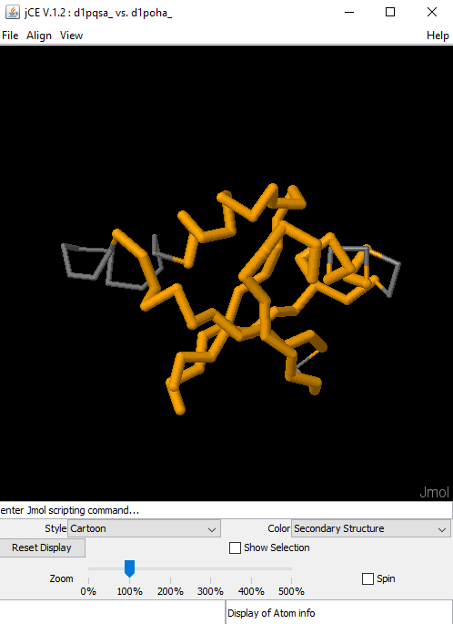
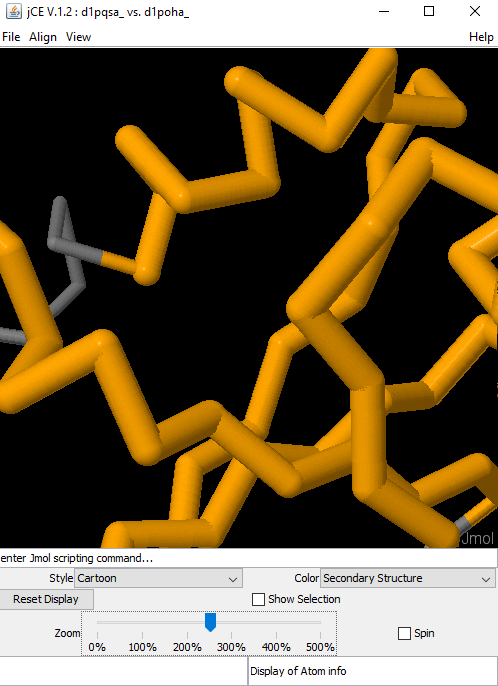

#Software Maintenance/Evolution

Software change is inevitable since new requirements emerge whenever the software is used, the business environment is always changing, errors must be repaired when detected, new equipment emerge everyday, and the system performance or reliability may have to be improved. For that reason, software systems have to evolve to continue to be useful and a lot of time and the majority of budget is spent on that, rather than in initial development.

To do so, developers must keep in mind the software evolution process: 

1. change requests: are the driver for evolution
2. impact analysis: the software evolution process changes should be linked with components that are affected by the change, thus allowing the cost and impact of the change to be estimated
3. release planning
*1 fault repair
*2 platform adaptation
*3 system enhancement
4. change implementation: analyse, design, code and test 
5. system release

Software maintenance is the key to a future-proof code and implies that the program will be modified after it has been put into use, so that new versions of the software can be created, allowing the product to be constantly updated.

There are four main types  of  software  maintenance:

* **Corrective Maintenance**: bugs are discovered and have to be fixed.

* **Adaptive Maintenance**: the system has to be adapted to changes in the environment in which it operates.

* **Perfective Maintenance**: users  of  the  system have  new  or  changed  requirements.

* **Preventive Maintenance**: ways  are  identified  to  increase  quality  or  prevent  future  bugs  from  occurring.

In software development, the maintenance phase of a software system often spans ten years or more. During most of this time, there is a continuous stream of issues that need to be resolved (corrective and adaptive maintenance) and enhancement requests that have to be met (perfective maintenance). The efficiency and effectiveness with which issues can be resolved and enhancements can be realized is therefore important for stakeholders.

Another reason that makes maintainability a special aspect of software quality is that it acts as an enabler for other quality characteristics. When a system has high maintainability it will be easier to make improvements in the other quality aspects, such as fixing a security bug. More generally speaking, optimizing a software system requires modifications to its source code, be it on performance, functional suitability, security, etc.

SGI metrics have emerged to help software developers to write better code that assures the maintainability of the software they are developing. The three most important guidelines of SGI are:

1. Maintainability benefits most from adhering to simple guidelines. Every individual contribution counts.

2. Maintainability is not an afterthought, but should be addressed from the very  beginning of a development project.

3. The more a software system complies with the guidelines, the more maintainable it is.

Maintainability is a quality characteristic on a scale. It signifies different degrees of being able to maintain. SIG divides the systems in the benchmark in stars, ranging from 1 star (hardest to maintain) to 5 stars (easiest to maintain). The distribution of these star ratings among systems from 1 to 5 stars is 5%-30%-30%-30%-5%. The star ratings serve as a predictor for actual system maintainability. The systems in the benchmark are ranked based on their metric quality profiles.

It is possible to see all of this applied to our project later in this report.


## Software Maintainability using the SIG Metrics

Since it is a quite complex project composed by more than 100.000 lines of code, two sub repositories had to be made in order to analyze it with Better Code Hub. For that reason, we runned Better Code Hub twice, in order to understand the differences that would appear when using each of the sub repositories. First it was chosen the part of the repository that included several demonstrations with a graphical user interface already used in the previous assignment: Structure GUI. For the second sub repository we included the same as in the first one, plus one of the modules that it had a dependency on: the Core module. The results can be seen [here](https://github.com/jalves94/biojava/tree/master/ESOF-docs/BetterCode_reports).


###Write Short Units of Code

In projects that are quite complex, with a lot of lines of code and that require several contributors, one of the most important factors is to write code that all people can read and understand. A unit is considered a small group of code that is possible to obtain by dividing the project in smaller parts that can be runned and tested independently and in an efficient way. Logically, smaller units (considered to have 15 lines of code) are easier to test, implement and even to understand, being self-explanatory most of the times. 

Looking at the results provided by both analysis, it is easy to conclude that this BioJava sub-project has half of its units with more than 15 lines of code, some of them with more than 30 and even more than 60 lines of code. Considering that the included packages are a reliable sample of the whole project, BioJava does not have the requirements needed for having a good grade in this metric. This result was expected since, even though there isn’t a lot of unused code, one of the contributors already said that BioJava is very disorganized.


###Write Simple Units of Code

Write simple units of code is important because the code will be easily understood and changed and fewer tests will be needed to test it. A piece of code that can look really complex for a common user can be seen as simple for its developer. Thus, code complexity is a disputed quality characteristic. The complexity of an unit of code can be evaluated by the number of tests needed to test the unit, the number of branches that it has and by the risk taken and time spent to change it. The number of branches can be measured calculating the number of possible paths through a piece of code. It can be determined by the number of branch points, i.e. statements where the executions can take more that one way, like the "if"ù and "switch"ù statements used in JAVA.

The results from this part have shown for both analysis that the code has a large number of code units with more than 5 branch points (more than 25,2% of the units). Some of them (2 for the test only with the _structure-gui_ package and 4 for the test with _structure-gui_ and _core_ packages) have more than 25 branch points which reveals a high code complexity. This means that the complexity of the packages is high since they don't pass the McCabe system test. 

To avoid this complexity it would be necessary to split the methods into smaller ones so that they will be easier to understand and therefore to change. For instance, trying to split an “if” or “switch” chain to smaller different methods that implement each one of the conditional statements. That way it would be easier to understand the path of the unit and therefore, if some change is required, it would be easy to detect the method that has to be changed.


### Write Code Once

Donít copy code. Even if it looks easier, the copied code can lead to duplicates. If those duplicates have bugs, they will be harder to fix since the code has to be fixed in more than one place and more errors can be made on the correction process. Another problem of duplicates is analyzing and detecting the source of the problem when a bug occurs in that part of the code.

The packages used for analysis have less than 95,4% of non duplicated code so it means that the project has a lot of redundant code and consequently its packages have a lot of copied code. 

To avoid this practice, the methods that are needed in more than one part of the code should be placed in one method that can be called wherever it is needed in the project. If the code is from another project, the necessary features should be imported and re-written instead of being copied, as that way it will be easier to understand and change in case of an error.

In conclusion, it would be a good practice to review and rewrite the code from at least the two analyzed packages by trying to understand which parts should be changed to facilitate the understanding of the code. This fact can be a problem in attracting new contributors to his open-source project.

### Keep Unit Interfaces Small

Unit interfaces are parameters that, if presented on high number, make the code hard to reuse, understand and, consequently, maintain. For that reason, it is good practice to have most methods with one, two, three or four parameters and, if possible, to group variables into an object.

In the _structure-gui_ and _core_ packages, there are some methods that have more than 6 parameters and the percentage of the evaluated project that has at most two parameters does not reach 83%. For that reason, BioJava does not have a good grade on this metric. Thinking about the structure of an object and how it can be related to the rest of the code before introducing it is the best way to keep unit interfaces small.

### Separate Concerns in Modules
As already said in previous reports, each module of the project has its own function. However, the modules need each other to be able to perform. There are separate packages for a specific functionality. However, classes are really large and inside one particular package they donít have separate concerns. Thus, a class can be called multiple times by an outside class. The number of calls of this kind is considered for this metric. 

Looking at the results, it is possible to see differences between the two considered analysis. Including just the _structure-gui_ package, this metric has a good grade, due to the fact that most of the classes are called no more than 10 times and just a few have more than 50 calls. However, with both _structure-gui_ and _core_ packages, there are more classes that are called more than 50 times, leading to a bad classification in this metric. This is due to the fact that with the _core_ package, there is no proportional increase of classes with few and many calls and classes have more than one functionality/responsibility. In order to prevent this type of situations (preventing classes from getting a "large class smell"), classes must be slipped. A better separation of concerns can lead to a controlled maintenance of the project since a small change in one class does not have a huge effect in others.

### Couple Architecture Components Loosely
This topic deals with dependencies on the component level. A component has to have its boundaries well defined and should be weakly dependent from the other components of the project. The previous topic approached the dependencies between modules, i.e. the classes from one module that are called in another one. Yet, this one will cover the exposure of modules inside a component with other modules from a different component. Weak dependencies between components will lead to an easy maintenance since changes on each component will only affect itself. 

In the BioJava project the components will be its packages. On the first analysis it will have one component, the _structure-gui_ package, and in the second one it will have also the _core_ package.

The results from the evaluation of these dependencies are good in both analysis. The percentage of modules from one package that have incoming dependencies from modules in other package (interface code) is lower than 14,2%. 

This result means that the maintainability of this project in relation to the dependencies between modules inside components is facilitated. So, changes in modules, i.e. on a top-class or interface, from one of those packages would be easily understood and fastly fixed. The fact that the modules inside the packages are isolated would facilitate the split of the maintenance of each one in different contributor teams.

### Keep Architecture Components Balanced

A balanced project should have a reasonable number of top components, for instance (in this case) between 2 and 12, with approximately the same size. This way the components will have almost the same size in terms of system logic contained. If the components are really large, the navigation inside the components and its maintenance will be harder. Also, if there is a high number of top components, the system logic will be scattered and understanding and following the progress in the project is hard as well.

In the first analysis, where it is only used the _structure-gui_ package, the results give only 1 main component and a perfectly equal size between components, which makes sense since there is only one component (_structure-gui_ package). The result for this test is negative, which is normal because thereís only one package and one package in this analysis, and to be positive the number of components has to be higher than 2. So, it can be concluded that the package should be divided in more components to facilitate the understanding and maintenance of each part of the system.

In the analysis of the _structure-gui_ and _core_ packages together the result of the test is positive because it has 2 components (one for each different package) and they are equally sized. 

As the code is quite complex, the interpretation and maintenance of each package would be easier if they were divided in a higher number of components because the amount of code and logic parts in each component would be smaller.

### Keep Your Codebase Small

In general, a  project that it is easy to maintain has a small codebase. A codebase is a set of code present in one repository that can be compiled and deployed independently and maintained by just one team. It is obvious that a larger project (with more implemented functionalities) has a larger codebase, but the key is to add value to a project with the minimum lines of code possible. Also, refactoring existing code (for example, simplifying its structure, removing code redundancies and simplification) and improving the amount of reuse are two important techniques to reduce code.

Regarding the size of the codebase, BioJava has a good score in both analysis. This metric is related with the volume of development effort needed to reproduce the system, and is measured by the number of manyears, being 20 manyears a good number. However, BioJava has much more packages, so this metric is not as reliable as others, since volume would certainly have a higher number for the whole project.

### Automate Tests

In the last assignment the testability of the project was already studied. It was seen that the coverage for the _structure-gui_ package was of 1,2% (Junit tests) which matches the value from this analysis, 1%. Since this package is quite big (14261 lines of code) the coverage of the automatic tests should be higher than 50%. So it means that the code from this package is not automatically testable or the developers didnít create enough tests. The assert density, which is the amount of documentation with the expected behavior in each test, is of 8% which is inside the range that is expected for a package with this size.

When both packages are analyzed, the coverage of the tests is of 12% and the assert density of 18%. The value of coverage is really small for a total of 28833 lines of code which, as concluded in last paragraph, means that both packages are not well automatically tested. The value of the assert is good since it is higher than 5%, so it means that a really considerable part of the tests have the assertions of the expected results.

### Write Clean Code

It is obvious that cleaner code leads to a more maintainable project. Clean code is related to:

* Not having dead on the project (code that will not run in any condition);

* Not having bad comments on the project, such as code;

* Not having too long and technical identifier names;

* Not having magic numbers (constants) on the code (it is better to define a variable for the purpose);

* Not leaving badly handled exceptions behind with no information about the context of the exception;

* Not leaving unit level ìcode smellsî behind as already described in previous sections.

Respecting these rules can lead to a reduction of the number of general comments that are needed, making the code self-explanatory and facilitating the maintenance of the project.

Results from this part have shown for both analysis that the code of BioJava is clean with just a few violations. Results are in agreement with last reportís results since there was only a few unused code in the project.

## Feature Evolution

The _structure-gui_ package provides a lot of functionalities to visualize different proteins and its structure, ligands and also connexions. In the graphical user interface itself, there are some buttons and windows to select properties like color and style. Additionally, clicking with the right mouse button on the panel, a menu is shown with more properties and options: zooming, spinning, capturing as an image, recording a GIF, etc. However, using the right click is not intuitive at all since there are options that, as previously said, can be set through controls that are already visible when the user interface is opened. This can induce users to think that there are no more available options. To avoid this problem it would be easier if some of the most important options were available in the main window of the GUI.


Considering that zooming is one of the most important features to be able to visualize a protein in a better way, implementing a control to set the zoom is one of the features that we decided to evolve. Enhancing this feature means giving the user the opportunity to zoom in and out as many times as he wants inside a predefined range (0% until 500%). Additionally, spinning the protein also allows a better visualization of the structure, so we decided to add the possibility to start and stop the spinning of the protein.


Looking at the code, it is relatively easy to understand that the modifications necessary to implement the features have to be done in the class where the interface is defined, along with the Jmol panel (Jmol is the library used for the 3D visualization of the protein). Analysing one of the demos of the _structure-gui_ package (`DemoCE.java`), it can be seen that the following instruction is performed:


```java 
StructureAlignmentDisplay.display(afpChain, ca1, ca2);
```

The `display` method returns an object of class `StructureAlignmentJmol` which is where the interface is defined. Therefore, this was the only class that needed to suffer modifications, as the implemented changes donít interfere with any other part of the project (low change impact).


The `StructureAlignmentJmol` class uses a GUI widget toolkit for JAVA called Swing to implement the interface and its components. So, in order to implement the zoom feature, an object of class `JSlider` was used. Adding a _ChangeListener_ to the object, it is possible to detect when the user changes the position of the cursor on the bar and get the corresponding value. This value (between 0 and 500) is used to change the Jmol scripting command that is going to be executed (ex: "zoom 300"). Regarding the spinning feature, an object of class `JCheckBox` was created. Using an _ItemListener_, it is possible to distinguish whether the box is checked or not, and when it is, the protein starts spinning by executing the corresponding Jmol command "spin ON". On the contrary, when the box is unchecked, the executed command is "spin OFF".


The appearance of the interface after the implementation of the features is the following:







### Link to pull request

The pull request for the implementation of these features can be found [here](https://github.com/biojava/biojava/pull/619).